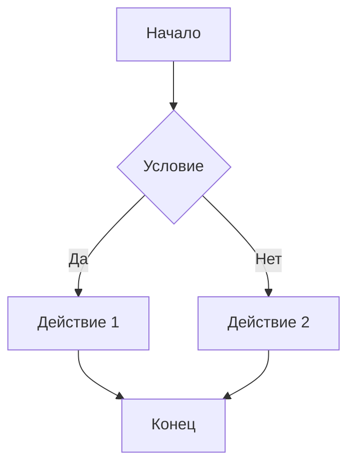
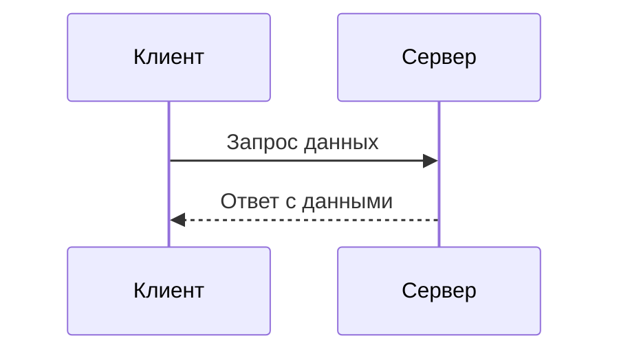

---
hide:
  - toc
---

# Руководство по форматированию Markdown

В этом руководстве собраны примеры использования различных элементов форматирования, доступных в вашей конфигурации MkDocs.

## Оглавление
[TOC]

## Базовое форматирование

### Аббревиатуры
*[HTML]: Hyper Text Markup Language
*[CSS]: Cascading Style Sheets
*[JS]: JavaScript

Технологии HTML, CSS и JS являются основой современной веб-разработки.

### Списки определений

Markdown
: Облегчённый язык разметки
: Создан для написания документации
: Поддерживает конвертацию в HTML

Git
: Система контроля версий
: Позволяет отслеживать изменения в файлах

### Таблицы

| Выравнивание слева | По центру | Выравнивание справа |
|:-------------------|:---------:|-------------------:|
| Текст слева | Текст по центру | Текст справа |
| Данные | Значение | Число |

## Блоки примечаний (Admonitions)

!!! note "Заметка"
    Это простая заметка с полезной информацией.

!!! tip "Подсказка"
    Так отображается блок с подсказкой.

!!! warning "Предупреждение"
    Важное предупреждение для пользователей.

!!! danger "Опасность"
    Критически важная информация.

??? question "Раскрывающийся блок с вопросом"
    Этот блок можно развернуть, чтобы увидеть ответ на вопрос.
    
    Можно добавить много текста и даже использовать другие элементы форматирования внутри.

## Форматирование текста

Различные способы выделения текста:

- ==Выделение важного текста==
- Формула воды: H^2^O (надстрочный текст)
- Химическая формула: CH~3~-CH~2~-OH (подстрочный текст)
- ~~Зачеркнутый текст~~
- **Жирный текст** и *курсив*
- ***Жирный курсив***

## Списки задач

- [x] Изучить базовый синтаксис
- [x] Разобраться с расширениями
- [ ] Написать документацию
    - [x] Создать структуру
    - [ ] Добавить контент
    - [ ] Проверить форматирование

## Вкладки

=== "Python"
    ```python
    def hello_world():
        print("Hello, World!")
    ```

=== "JavaScript"
    ```javascript
    console.log('Hello, World!');
    ```

=== "Bash"
    ```bash
    echo "Hello, World!"
    ```

## Блоки кода

### Python с номерами строк
```python linenums="1"
def factorial(n):
    if n == 0:
        return 1
    return n * factorial(n - 1)

# Вычисляем факториал
result = factorial(5)
print(f"5! = {result}")
```

### Подсветка строк
```python hl_lines="2 3"
def hello(name):
    # Эта строка будет подсвечена
    message = f"Hello, {name}!"
    return message
```

## Эмодзи

Часто используемые эмодзи:

- :smile: `:smile:`
- :heart: `:heart:`
- :thumbsup: `:thumbsup:`
- :rocket: `:rocket:`
- :warning: `:warning:`
- :bulb: `:bulb:`

## Диаграммы Mermaid

### Блок-схема


### Диаграмма последовательности


## Кнопки и ссылки

[Первичная кнопка](#){: .md-button .md-button--primary }
[Обычная кнопка](#){: .md-button }

## Таблица с подсветкой и иконками

| Операция | Описание | Статус |
|:---------|:---------|:------:|
|GET       |Получить данные|{ .green }✓|
|POST      |Отправить данные|{ .blue }○|
|DELETE    |Удалить данные|{ .red }⚠|

## Сноски

Текст с простой сноской[^1] и сноской с пояснением[^note].

[^1]: Это простая сноска
[^note]: Сноска с дополнительной информацией.
    Может содержать несколько строк.

## Клавиши

Используйте следующие комбинации клавиш:

- ++ctrl+c++ для копирования
- ++ctrl+v++ для вставки
- ++ctrl+alt+del++ для диспетчера задач

## Подсказки (Tooltips)

[Наведите курсор](tooltip "Это всплывающая подсказка")

## Дополнительные элементы

### Цитаты

> Это пример цитаты.
> Можно использовать несколько строк.
>> А также вложенные цитаты.

### Горизонтальная линия

---

### Математические формулы

Встроенная формула: \(E = mc^2\)

Формула в отдельной строке:

\[
    f(x) = \int_{-\infty}^{\infty} e^{-x^2} dx
\]

## Советы по использованию

1. Всегда предварительно просматривайте документацию через `mkdocs serve`
2. Используйте комбинации различных элементов для лучшего представления информации
3. Помните о мобильных пользователях при создании сложных таблиц и диаграмм

!!! tip "Совет по работе с редактором"
    Используйте специализированные редакторы с поддержкой Markdown для более удобной работы с форматированием.
