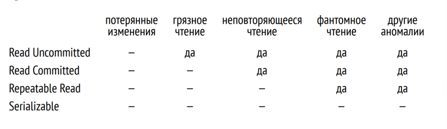

# Транзакция 

****Транзакцией называется множество операций, которые переводят базу данных из одного корректного состояния в другое корректное состояние (согласованность) при условии, что транзакция выполнена полностью (атомарность) и без помех со стороны других транзакций (изоляция).****

Согласованность:
Всем известно, что реалиционных СУБД сущесвтвуют ограничения целостности данных и СУБД ответственно следит за тем, чтобы они никогда не нарушались.

Атомарность:
Но некоторые условия слишком сложны для того, чтобы быть понятыми СУБД и могут нарушать согласованность (корректность) данных, не нарушая при этом целостности.
Обычно за согласованностью данных следит клиентское приложение, но иногда возникают ситуации, когда промежуточная операция приводит базу в несогласованное состояние и это нормально! (перевод денег)
В таких случаях, важно не зависнуть на этом промежуточном шаге и отменить изменения. С этим как раз и помогает СУБД, если, конечно, знает, что эти операции представляют собой неделимое целое.

Изолированность:
Есть и более тонкий момент - транзакции абсолютно правильные сами по себе, при одновременном выполнении, могут начать барахлить. Такие ситуации называются аномалиями.
Простой пример - если приложение хочет получить данные, то оно должно, как минимум, не видить незаификсированные изменения других транзакций. Иначе, если какая-то транзакция отменится, можно получить состояние, в котором база данных никогда и не была (грязное чтение)
Роль СУБД как раз в том, чтобы выполнять транзакци параллельно и при этом гарантировать, что результат такого выполнения будет совпадать с результатом одного из возможных последовательных выполнений.

Всего в стандарте SQL выделяют 4 уровня изоляции, каждый из которых определяется перечеслением аномалий, которые допускаются или не допускаются при одновременном выполнении транзакций.

**Грязное чтение и Read Uncommitted**

Возникает, когда транзакция читает еще не зафиксированные изменения, сделанные другой транзакцией

**Неповторяющееся чтение и Read Committed**

Аномалия неповторяющегося чтения (non-repeatable read) возникает, когда транзакция читает одну и ту же строку два раза, а в промежутке между чтениями вторая транзакция изменяет (или удаляет) эту строку и фиксирует изменения. Тогда первая транзакция получит разные результаты.

**Фантомное чтение и Repeatable Read**

Аномалия фантомного чтения (phantom read) возникает, когда одна транзакция два раза читает набор строк по одинаковому условию, а в промежутке между чтениями другая транзакция добавляет строки, удовлетворяющие этому условию, и фиксирует изменения. Тогда первая транзакция получит разные наборы строк.

**Отсутствие аномалий и Serializable**

Уровень, на котором не допускаются никакие аномалии. Чем отличается от repeatable read? Да все просто - он, конечно, снимает все описанные в стандарте аномалии, но не все известные практике и науке. В частности, еще остаются:
- Несогласованная запись 
- Аномалия только читающей транзакции

Serializable реализован как надстройка над изоляцией на основе снимков данных. Те аномалии, которые не возникают при Repeatable Read (такие как грязное, неповторяемое, фантомное чтение), не возникают и на уровне Serializable. А те две аномалии, которые возникают (несогласованная запись и аномалия только читающей транзакции), специальным образом обнаруживаются, и в этом случае транзакция обрывается: возникает уже знакомая нам ошибка сериализации

Итого:

**Уровни изоляции в PostgreSQL**

Со временем на смену блокировочным протоколам управления транзакциями пришел протокол изоляции на основе снимков (Snapshot Isolation, SI). В PostgreSQL реализован многоверсионный вариант протокола SI

За счет использования снимков данных изоляция в PostgreSQL отличается от той, что требует стандарт, и в целом она строже.

