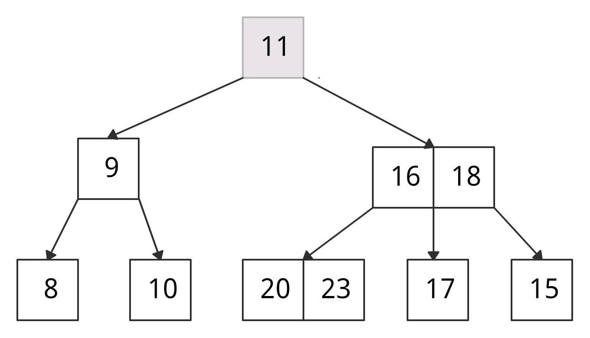
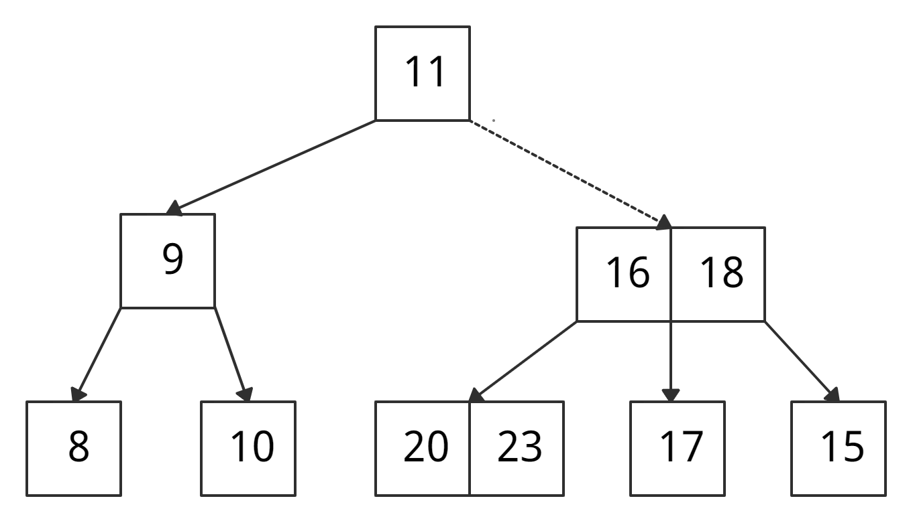
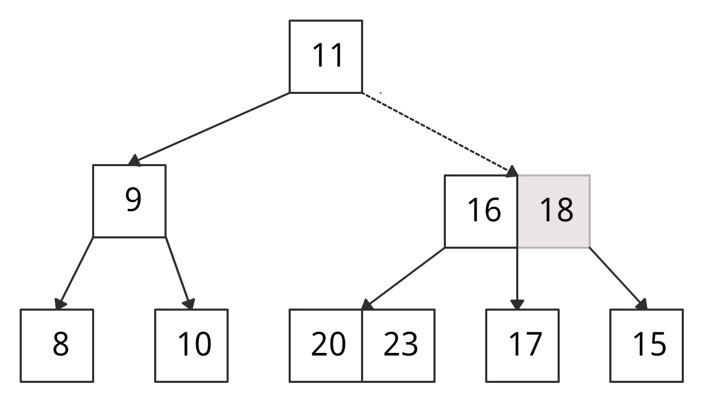
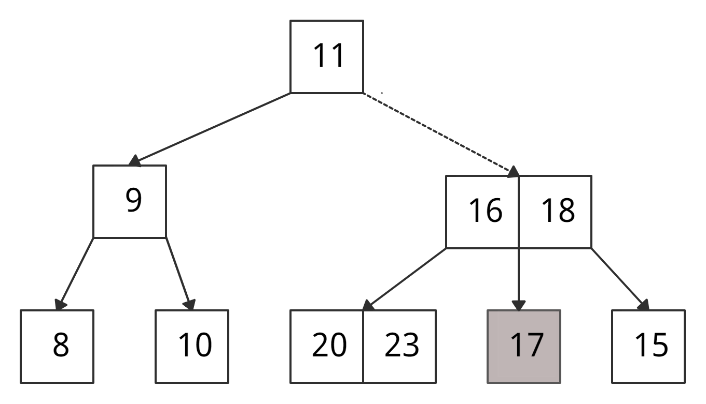

## Индексы

Индексирование баз данных — это техника, повышающая скорость и эффективность запросов к базе данных. Она создаёт отдельную структуру данных, сопоставляющую значения в одном или нескольких столбцах таблицы с соответствующими местоположениями на физическом накопителе, что позволяет базе данных быстро находить строки по конкретному запросу без необходимости сканирования всей таблицы.

Селективность индекса -  характеристика, определяющая, насколько эффективно индекс разбивает данные.

Примеры индексов и их селективности:
- Номер паспорта: высокая селективность
- Возраст человека: средняя селективность
- Пол человека: низкая селективность

В случае достаточно низкой селективности индексы не используются, так как в такой ситуации полное последовательное чтение таблицы эффективнее, чем несколько случайных чтений.

## B-tree

- Это именно дерево поиска, то есть - полезная нагрузка хранится в листьях
- Оно сбалансированно, то есть - высота левого и правого поддеревьев каждого узла отличается не более чем на единицу.

B-дерево (читается как Би-дерево) — это особый тип сбалансированного дерева поиска, в котором каждый узел может содержать более одного ключа и иметь более двух дочерних элементов. Из-за этого свойства B-дерево называют сильноветвящимся. 

Свойства
- Ключи в каждом узле x упорядочены по неубыванию.
- В каждом узле есть логическое значение x.leaf. Оно истинно, если x — лист.
- Каждый узел, кроме корня, содержит не менее t-1 ключей, а каждый внутренний узел имеет как минимум t дочерних узлов, где t — минимальная степень B-дерева.
- Все листья находятся на одном уровне, т. е. обладают одинаковой глубиной, равной высоте дерева.
- Корень имеет не менее 2 дочерних элементов и содержит не менее 1 ключа.

Поиск элемента Θ(log n)

- Сравниваем k с первым ключом узла, начиная с корня. Если k = первый ключ узла, возвращаем узел и индекс.
- Если k.leaf = true, возвращаем NULL. Элемент не найден.
- Если k < первый ключ корня, рекурсивно ищем левый дочерний элемент этого ключа.
- Если в текущем узле более одного ключа и k > первый ключ, сравниваем k со следующим ключом в узле.
- Если k < следующий ключ, ищем левый дочерний элемент этого ключа (k находится между первым и вторым ключами).
- Иначе иначе ищем правый дочерний элемент ключа.
- Повторяем шаги с 1 по 4, пока не дойдем до листа.

Пример: хоти найти ключ k = 17

• k нет в корне → сравниваем k с ключом корня.

• k > 11 → идем через правого «ребенка».

• Сравниваем k с первым ключом узла: k > 16 → сравниваем k со вторым ключом узла. 

• k > 18 → k лежит между 16 и 18. Ищем либо в правом «ребенке» 16, либо в левом «ребенке» 18.

• Нашли 17.

## Хеш-индекс

Хэш-индекс — это разновидность методики индексирования баз данных, использующая хэш-функцию для сопоставления ключей индекса с местоположениями соответствующих записей данных. Это быстрый метод индексирования для запросов точного соответствия в одном столбце.
