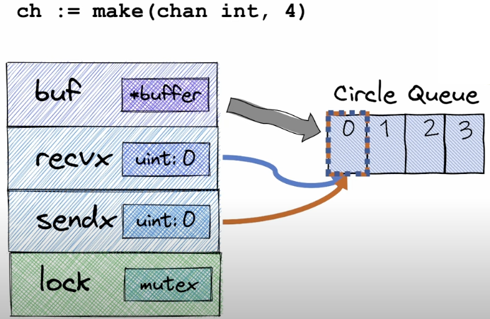
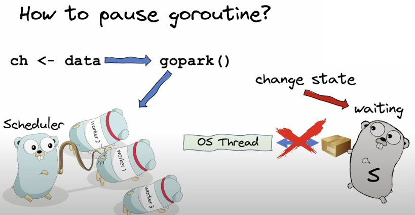
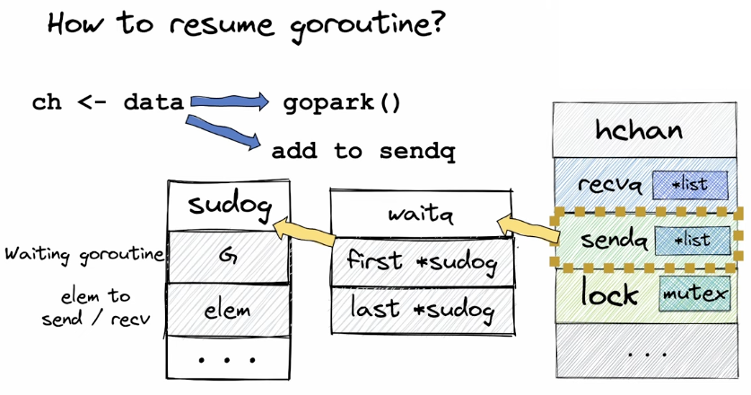
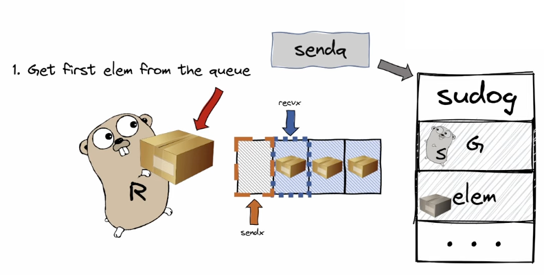
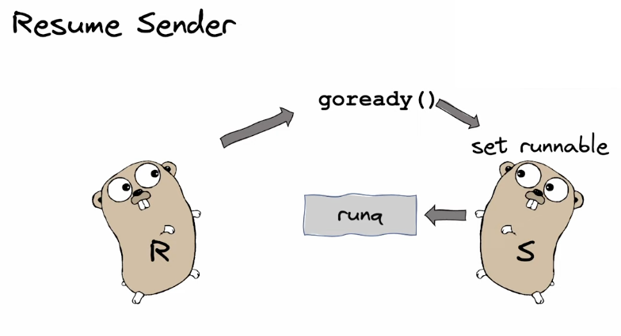
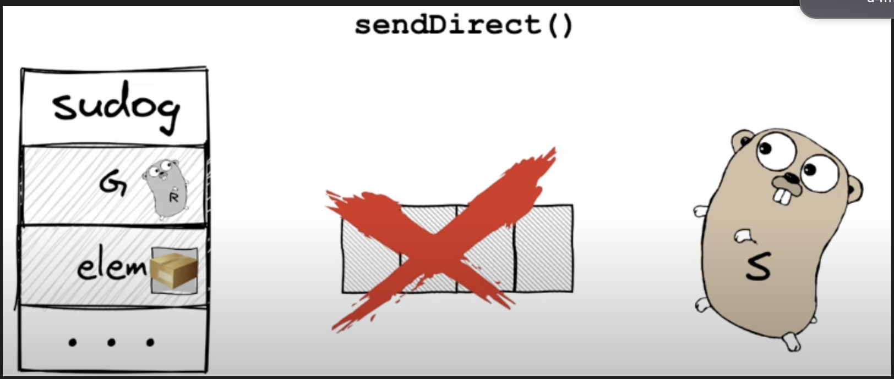
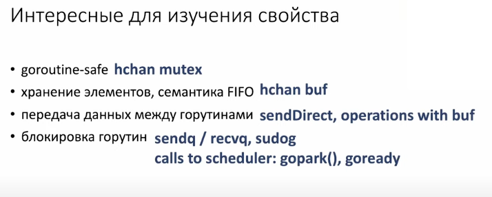
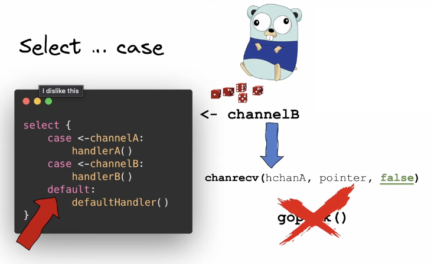

##  Как устроены каналы

## Свойства каналов:

- goroutine-safe
- хранение элементов в FIFO
- Передача данных между горутинами
- блокировка горутин
## Попробуем реализовать свой канал

- Где он должен храниться?
  Ответ очевиден - конечно в Куче, так как каналы нам нужны для общения между горутинами, у каждой из которых свой стек

- Что он из себя представляет?
```Go
type chan struct {
	qcount uint // кол-во элементов, которое хранится в буфере
	dataqsiz uint // размер буфера
	buf *buffer // ссылка на буфер
	closed uint32 // флаг, который говторит закрыт ли канал
	elemsize uint16 
	elemtype uint32
	recva *list // связный список из горути, ожидающий чтения или записи
	send *list
	recvx uint // номер ячеек буфера из которы призводится чтение и запись
	senddx uint
	lock mutex
}
```


Начнем с малого, сфокусируемся на свойствах goroutine-safe и хранение элементов в FIFO. Для реализации такого функционала нам хватит нехитрой структурки:
```Go
type chan struct {
	buf *buffer // ссылка на буфер
	recvx uint // номер ячеек буфера из которы призводится чтение и запись
	senddx uint
	lock mutex
}
```

Это будет простая кольцевая очередь, где один элемент запоминает с какого момента начинаем писать, другой - с какого читать 



Отлично! С этим разобрались. Теперь посмотрим как устроены передача данных в канал и их чтение оттуда.

В общих чертах, механика не сложная:
1) Заблокируем мьютекс
2) СКОПИРУЕМ данные в канал, если пишем и прочитаем и из канала, если читаем
3) Разблокируем мьтекс

НО! Возникают некоторые трудности, связанные с оставшимся свойством - блокировка горутин

Рассмотрим пример, когда sender пытается отправить больше данных, чем размер буффера. В таком случае, он должен заблокирироваться. Как это сделать?

1) Функция, которая отвечает за отправку данных в канал, в свою очередь, вызовет функцию gopark(), которая обращается к планировщку, чтобы тот поменял состояние горутины из running в waiting
2) Планировщик разрывает связь горутины с ее тредом, таким образом, тред становится свобоным и планировщик отдает ему другую горутину из очереди 



4) Усыпить то усыпли, но как потом разбудить? Для этого, помимо вызова gopark(), функция, которая отправляет данные в канал, еще добавит горутину в очередь sendq. Данная очередь хранит ссылку на структуру waitq, в которой лежит начало и конец односвязаного списка. Элементы данного списка представляют из себя также структурки, одними из полей которых как раз являются G- спящая горутина и elem, который мы пытаемся отправить или ссылка на ячесйку, которую хотим прочитать 



6)  Когда получатель прочитает данные из буфера - в нем освободится место, и тогда наконец-то на спящая горутиночка может проснуться. Но как она поймет что пора? К ней прийдет получатель и шепнет об этом на ухо



7) Но что именно делает ресивер? По аналогии с сендером, он обращается с помощью к могучему планировщику и вызввает функцию goready(), которая полностью противоположна gopark(). Первым делом, она поменяет состяние спящей горутин на runnable(), что будет означать, что он готов к запуску и горутина попадет в очередь runq из которой она начнет выполняется как только освободитя какой-нибудь тред. 



   Основными плюсами такой оптимизации (что будит горутину ридер) явл-ся:
- Мьютекс канала будет заблокирован лишь один раз
- Канал станет доступным тогда, когда ресивер завершит работу и нам не нужно ждать когда планировщик опомнится
8) Теперь рассмотрим симметричную ситуацию - когда ридер приходит читать из канала, а там ничего нет. Происходит почти все тоже самое - вызывается ф-ия gopark(), reader уходит в паузу и reader уходит в очередь recva, которая полностью аналогична senq, только в качестве elem будет уже не элемент, а ячейку памяти, в котрую нужно положить данные прочитанные из канала.
9) Когда приходит sender - он, по идее, должен положить данные в буфер и ридер прочитает иъ оттуда и разблокируется. НО! Это было бы супер не оптимально, так как пришлось бы совершать 2 копирования. Поэтому, все работает несколько иначе - вызывается ф-ия SENDDIRECT(), которая шарит стек сендера для ресивера. ЭТО ЕДИНСТВЕННОЕ место в го, где такое возможно! 



10) Все это время мы говорили про буфферизированные каналы, но как обстоят дела с небуферищированными? Точно такая же опитимиация - используется ф-ия SENDDIRECT()
    ИТОГО:



11) Как работает Select? Первое, что происходит - это случайная сортировка case-ов, чтобы порядок обхода не был определен. Далее происхоит обход кейсов в установленном порядке.
12) Каждый раз, попадая в ветку, вызывается ф-ия chanrecv со следюущими параметрами: chanrecv (hchanA, pointer, false). False, в данном случае, будет означать, что чтение должно быть неблокирующим, чтобы мы могли попасть в остальные ветки тоже и мы могли попасть в дефолт. На практике, это означает, что мы не будем образаться к ф-ии gopark() 



13) Сами case представлены в программе следующим образом:
```Go
type scase struct {
	*hchan // chan
	elem unsafe. Pointer // data element
}
```
14) Как реализовано закрытие канала:
- Проверяем инициализирован ли канал (паника, если нет)
- Блокируем мьютекс
- Закрыт ли канал? (паника, если да)
- Меняем значение closed на 1
- Отпускаем все ридеры, то есть - они больше не будут блокироваться и будут без конца читать zero-value
- Отпускаем всех writer-ов - они запаникуют
- Разблокируем мьютекс
- Разблокируем все ждущие горутины