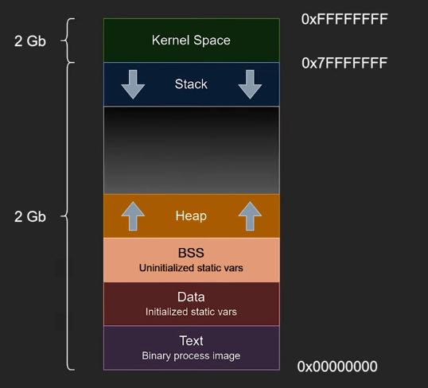
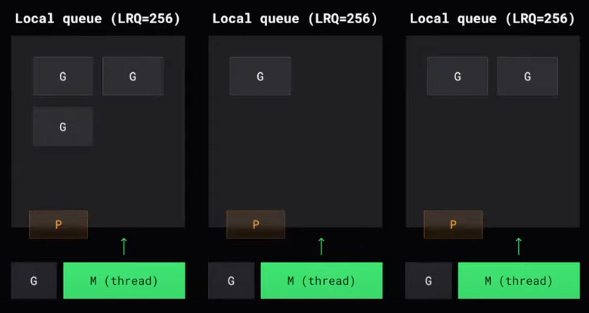
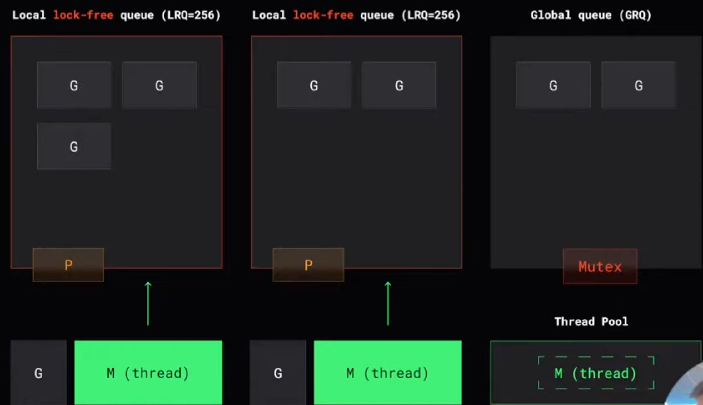
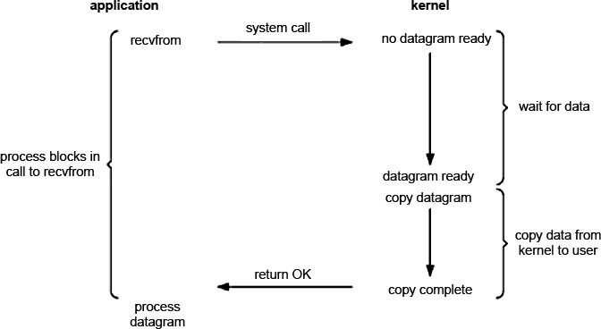
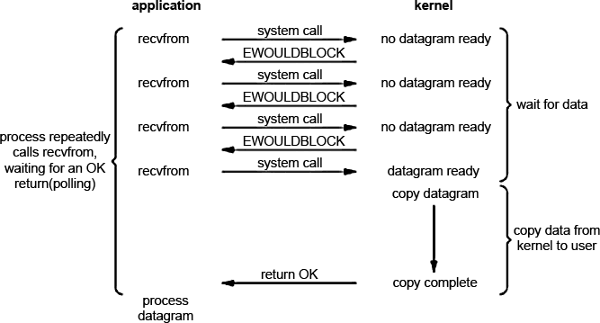
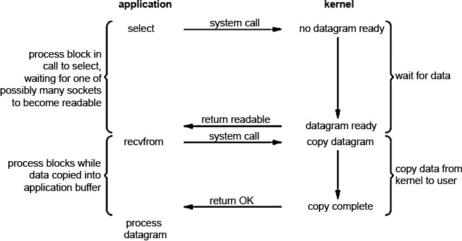
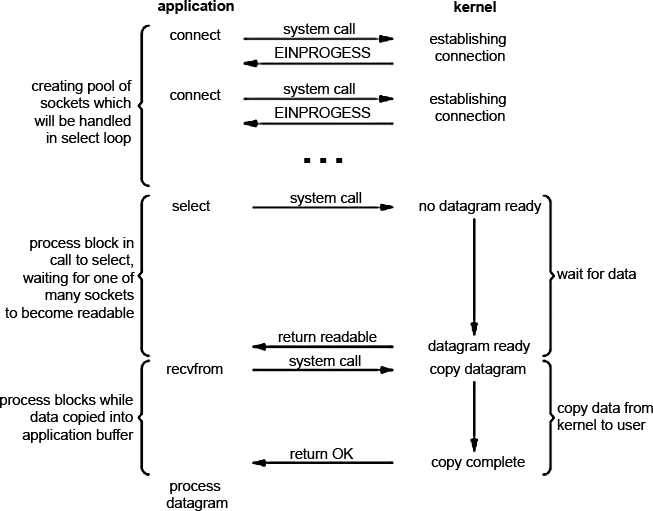
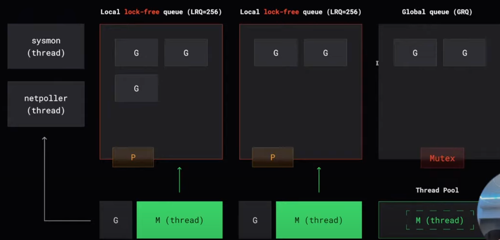
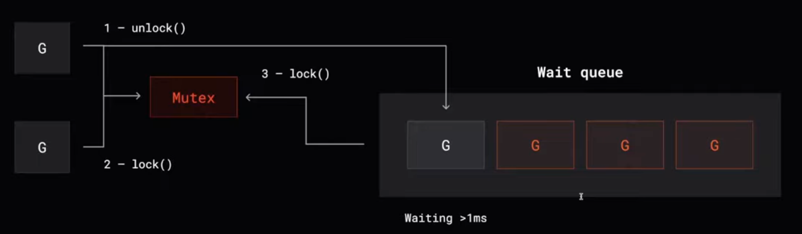

## Создаем планировщик

Google: Нам нужен нормальный язык для разработки веб-сервисов!
GO: ОК... Что в вашем вебе вы делаете?

Google: Читаем, пишем, джсоны перекладываем короче
GO: Понятно, значит IO bound нагрузка, сколько же вы тратите на переключение контекстов?

Google: Столько ни одному сеньору даже не снилось
GO: Ок, порешаем...

Google: Ура!
GO: Пойдет, если сделаю кайфовое управление потоками? Замутим отдельный поток под каждый коннект

Google: Блин, ну не, это дорого и медленно, нам нужно что-то по-интереснее
GO: Почему?
Google: Звучит как вопрос для лекции на пару часов, ну ты сам напросился

Основная задача ОС - выполнение программ, посе компиляции программы ее код переводится в набор машинных инструкций, которые может выполнить процессор. Для выполнения этой программы нужно совершить ряд действий, например: выделить программе необходимые ресурсы и загрузить ее в память, после - программа становится готовой к выполнению и называется процессом. То есть, процесс - это программа в состоянии выполнения. В него входит:
- Исполняемый код
- Данные, ассцоциированные с этим кодом
- Контекст - вся инфа нужна для управления процессом, например: pid, состояние регистров цп и содержимое стека. Именно он используется для переключения между процессами, позволяя сохранять и востанавливать состяние каждого из них.
  Адресное пр-во в современных ОС яал-ся виртуальным и изолированным. В нижней его части помещается код программы, дальше - область данных программы, которая содержит переменные и области памяти выделенные статически или динамически, дальше - куча, с противположной стороны - стек, которы используется для хранения инфв о вызовах ф-ий и системных вызовах, а, также, передачи парамтеров в фукции.
  Во многих ОС в адресное пр-во по фиксированному адресу проецируется ядро.

Каждый процесс полностью независим от других и обладает собственным адресным пр-вом и средрй выполнения.




В программах обычно происходит много различных операций, которые занимают очень разное кол-во времени и выполнять их последовательно или создавать под каждый пук отдельный процесс - супер тупо. Поэтому, нужно как-то отлепить понятие процесса, те адресного пр-ва и ресурсов ос от базовой единицы выполнения - потока.

Таким образом, процесс определяет адресное пространство и общие атрибуты процесса, а поток опредедяет последовательный поток выполнения в рамках этого процесса. Поток привязывается к одному процессу, но в одном адресном пр-ве - может быть много потоков, что обеспечивает легкий доступ к общим данным. Поэтому их создание занимает мало времени, потому что не нужно заново выделять адресное пр-во. В итоге, объектом планирования в ОС становтся потоки, а процессы служат "контейнерами" для их выполнения.

Простыми словами, поток - это просто контекст для выполнения какого-то кода. В него входят регистры, instruction pointer и стек. При переключении этого самого контекста - нам нужно снять регистры, положтьб их, допустим, на стек этого потока и взять регистры другого потока, загрузить их в процессор, взять новый стек и начать выполнение другого кода и этим всем занимается ЯДРО, Карл. Более того, при переключении потока - кеши из процессора, которые были заточены под выполнение опр-ного кода - тупо затриаются, а если поток давно не использовался и у тебя включен swapping - то вообще прийдется идти на (о ужас) диск.

Кстати, есть одна крутая фишечка - в ядре ОС есть системные вызовы, которые предназначены для создания новых потоков и потоками можно управлять исключтельно из режима пользователя!!! Каждый поток представляется регистром счетчика команд, остальными регистрами ЦП и стеком. Создание этого потока, переулючение между потоками и синхронизация выплняется вообще без участия ядра. Вот только, так как ядро не имеет никакого контроля над такими потоками - становится проблематично оссуществлять управление потоком ввода-вывода и блокировками... Ведь библиотека работчающая в режиме пользователя не может уорректно информировать ядро о состояниях различных потоков, ожидающих опр-ных событий.

GO: Ну ты и душнила, ладно, понял. Надо воспользоваться этой фичей, тогда постараемся решить эти вопросики с помощью хитрого планировщика, и будем сами создавать контексты, просто снимая регистры и пушить их в стек, заранее их подготовливать их. Таких контекстов мы можем создавать хоть попой ешь и ядро вообще не будет знать про наши контексты. В итоге, идея такая:
• Не даем в руки программисту поток
• Делаем вид, что есть только горутины
• Всю сложность распределения горутин
абстрагируем
Google: Это то, что нам нужно!!!
GO: Хм, посмотрим, можем попробовать выполнять N горутин на одном потоке, тогда весь оверхед а переключение контекста уйдет. А горутинки будут в очереди FIFO лежать. Я молодец? - я молодец. !
Google: Это прикольно, но как и когда мы будем вытеснять эти горутины? Понятное дело, что это можно делать при сисколах (обращених к диску итд), но как быть просто с прогамой, во время выполнени которой мы просто хотим переключить горутины?
GO: Блин, реально. Ну ок, тогда прийдется придумывать какие-то выкрутасы с многозадачностью самим. Давай начнем с кооперативной, это сильно проще и, заставим разработчика указывать в проге когда он хочет переключить контекст (начать выполнять другую горутину)
Google: Но мы же хотели сделать язык простым!
GO: Лаааадно.... Тогда давай компилятор будет сам добавлять места в исходный код для переключения контекста. Например, в момент проверки необходимого
пространства для стека горутины
Google: Забились. Вот только зачем мы покупали серверы по 100 процесоров в каждом? Как такая штука будет работать на них?
GO: Ооокей, сколько там процессоров говоришь? Давай сразу сотку потоков сделаем и будем горутинки по ним распихивать из общей очереди?
Google: Не, это фигня, потоки тогда будут обращаться к общей очереди, надо и будет как-то синхронизировать между собой
GO: Да вообще без - просто намутим очередь на lock-free структурах данных, атомики, например
Google: Это лучше, но все равно - тогда много ядер будут одновременно пытаться обновить счётчик. атомика, каждое из них становится в очередь и ждёт эту инвалидацию и вычитывание из кеша. Операция, которая должна укладываться в константное время внезапно становится O(N) по количеству ядер. Cache contention, короче говоря.
GO: О! Меня осенила гениальная мысль! Го просто пошардируем наши горутинки на потоки. Сделаем в каждом потоке локальную очередь и тогда поток будет обращаться только к его локальной очереди. Тогда у нас вообще не будет синхронизации. Еще добавим абстракцию, которая будет говорить, что у потока есть ресурс для выполнения кода, назовем это процессор. Тогда у нас выйдет:

G - Goroutine (что исполняем)
M - Machine (где исполняем)
??? P - Processor (права и ресурсы для исполнения)

То есть - пользователь может спокойно создавать грутину при помощи go и передачи функции, из которой потом начнется выполнениее кода в рамках уже новой горутины. Не благодарите!

Google: Рано еще благодарить, а кто по-твоему будет определять в какую из очередей добавлять новую горутину?
GO: Да просто в локальную очередб будем добавлять, где ее создали

Google: А что если они закончатся?
GO: Любишь же ты все усложнять... Получается, мы опять вернулись к проблеме синхронизации, так как, если поток будет ходить за гортинами к соседям - прийдется как-то их подружить. Ну ок, в принципе, это вообще будет происходить не так часто - так что остановимся просто на атомиках и пофиг на contension иногда

Google: Ладно, это лучше, чем ничего. Ты же предусмотрел в своем плане из какой именно очереди свободный поток будет красть горутину?
GO: Будем просто брать рандомно.

Google: А если там тоже нет?
GO: Постучимся еще раз

Google: А если опять нет?
GO: 4 раза постучимся

Google: Почему 4?
GO: Да прост, еще будем брать не по одной, а сразу половину, чтобы не ходить лишний раз по чужим очередям.

Google: Это все круто, но у нас выходит язык, который просто позволяет умело управлять потоками в пространстве пользователя, а мы то изначально хотели сделать кайфовый язык для веб-сервисов с огромным кол-вом io-bound нагрузки и, соответсвенно, с постоянными syscall-ами. Ты и сам знаешь, что это значит - прийдется идти в ядро, а, значит,  поток перейдет в состояние waiting, то есть - заблочится. ОС снимет его с выполнения на ядре и поставит другой иииии опять контекст свитчинг ОПЯТЬ. Так что, давай уже ближе к делу, ты же предусмотрел это?
GO: К-к-кончено (блин, что делать, надо что придумать... Думай, думай, думай, О!Идея!) - компилятор же под нашим контролем тоже, значит - миы можем делать все, что захотим. Поэтому, будем просто оборачивать сисколлы так, чтобы, если мы понимаем, что это на долго - будет открепляться поток (M) от процессора (P) и на его место будет ставиться новый и тогда горутинки не будут ждать долгих сисколлов и будут утилизироваться по максимуму в каждый момент времени.

Google: Ты знаешь как дорого создавать потоки?
GO: Ну ок, не будем создавать, сделаем thread pool и будем просто оттуда брать потоки

Google: Хорошо, допустим, сискол выполнился и нужно куда-то деть горутину, которая его инициировала, а у нас заполнена локальная очередь или поток, связанный с процессором выполняет syscall?
GO: Чувак, тебе надо быть тестировщиком. Как такое вобще в голову приходит? Ну ок, тогда прийдется делать еще одну очередь - теперь уже глобальную, где будут все неприкаянные горутинки, для нее тоже нужна синхронизация, сделаем просто мьютекс. Ну схемка у нас уже выходит...

Google: О, еще вот такая ситуация: есть 10к коннектов, каждый из которых вызывает read на сокете и продолжительне время не заканчивается, тогда 10к потоков открепится и создаться. Это , если стек 8мб, то 80гб что ли надо будет?
GO: Может ты сразу нормально обзначишь требования? Невозможно... Давай вспоминать какие у нас есть модели ввода/вывода в ос, авось что-то подойдет.
Так, ну вообще коммуникацию между двумя различными процессами, которые могут находится на разных компьютерах обеспечивают специальные файлы - сокеты. Раз уж зашла речь об этом - стоит упомянуть, что в Линуксе есть еще - Файлы блочных устройств, Файлы устройств посимвольного ввода-вывода, Именованные конвейеры (named pipe или FIFO), нам из них еще могут пригодиться для рассморения регулряные файлы. Но вернемся к нашим баранам.

Всего в Unix подобных системах доступно 6 различных моделей ввода/вывода. Рассмотрим 3 из них:
- Блокирующий I/O (blocking I/O)
 
  В данном случае процесс делает системный вызов _recvfrom_. В результате процесс заблокируется (уйдет в сон) до тех пор пока не придут данные и системный вызов не запишет их в буфер приложения.  
  После этого системный вызов заканчивается (return OK) и мы можем обрабатывать наши данные.  
  Очевидно, что данный подход имеет очень большой недостаток — пока мы ждем данные (а они могут идти очень долго из-за качества коннекта и т.п.) процесс спит и не отвечает на запросы.
- Неблокирующий I/O (nonblocking I/O)
  Мы можем установить неблокирующий режим при работе с сокетами, фактически сказав ядру следующее: «Если ввод/вывод, который мы хотим осуществить, невозможен без погружения процесса в блокировку (сон), то верни мне ошибку что не можешь этого сделать без блокировки.»
  
  Первые три раза, которые мы посылаем системный вызов на чтение не возвращают результат, т.к. ядро видит, что данных нет и просто возвращает нам ошибку EWOULDBLOCK.  
  Последний системный вызов выполнится успешно, т.к. данные готовы для чтения. В результате ядро запишет данные в буфер процесса и они станут доступными для обработки. НО Такой подход приводит к большим накладным расходам (overhead) процессорного времени.
- Мультиплексирование I/O (multiplexing I/O)
 При мультиплексировании ввода/вывода мы обращаемся к одному из доступных в ОС системному вызову (мультиплексору например select, poll, pselect, dev/poll, epoll (рекомендуемый для Linux), kqueue (BSD)) и на нем блокируемся вместо того, чтобы блокироваться на фактическом I/O вызове.
  
  Приложение блокируется при вызове select'a ожидая когда сокет станет доступным для чтения. Затем ядро возвращает нам статус _readable_ и можно получать данные помощью _recvfrom_. На первый взгляд — сплошное разочарование. Та же блокировка, ожидание, да и еще 2 системных вызова (select и recvfrom) — высокие накладные расходы. Но в отличии от блокирующего метода, select (и любой другой мультиплексор) позволяет ожидать данные не от одного, а от нескольких файловых дескрипторов. Надо сказать, что это наиболее разумный метод для обслуживания множества клиентов, особенно если ресурсы достаточно ограничены. Почему это так? Потому что мультиплексор снижает время простоя (сна).  
  Создается пул дескрипторов, соответствующих сокетам. Даже если при соединении нам пришел ответ EINPROGRESS это значит, что соединение устанавливается, что нам никак не мешает, т.к. мультиплексор в ходе проверки все равно возьмет тот, который первый освободился.

Последний вариант нам отлично подходит - в одном из потоков замутим event-loop и, когда будет сетевой вызов read или write -  не будем отгружать его на отдельнй поток, а отправим на поток с этим циклом (netpoller), он этот файловый дескриптор, с которым мы хотим совершить операцию чтени или записи добавит в мультиплексер и получается, что сокет будет сопряжен с горутиной и, когда прийдут данные - разблокируем горутину и вернем ее по такой же логике как когда мы открепляем поток от процессора. 

Google: Капец у нас уже очередей наплодилось... По твоей схемке, кстати, горутины из глобальной очереди бдут голодать выходить
GO: Да, точно, ща попрошу задротов-математиков провести некоторые рассчеты ....... Они говорят, что норм будет, если каждый 61 первый тик шедуллера будем ходить в глобальную очередь. Почему так? - хз, но говорят это минимизирует contension. Выходит так - раз в 61 одно обращение к шедуллеру он нас будет отправлять в глобальню очередь, в других ситкцаиях - если не нашли в локальной очереди, то идем в соседние, если не нашли и там, то идем в netpoller
```Go
runt ime. schedule( ) {
// only 1/61 of the time, check the global runnable queue for a G.
// if not found, check the local queue.
// if not found,
// try to steal from other Ps.
// if not, check the global runnable queue.
// if not found, poll network.
}
```

Google: Ок, теперь мы действительно обеспечили пользователя простыми инструментами, которые позволяют ему ничего не знать о системнах потоках, а только о горутинах, которые он легко может запускать. Но что делать, если ему вздумается писать глобаьные структуры данных, которые бдут модифицироваться и разны горутин? Боюсь, что нам никуда не деться от этой дурацкой синхронизации...
GO: Спокуха, замутим свои мьютексы для горутин. Для этого - вощьмем чейку памяти, в которой будет флаг сигнализирующий о том, что я горутина заблочена, если это так - попробуем пару раз еще прокрутить цикл, пытаясь его забрать - если не выходит - пойдем к планировщику и он тогда уж вытеснит эту гортину. Тогда у нас будет блокироваться не поток, а горутина. Введем состоние горутины
Running - выполняется
Runnable - готова к выполнению
Waiting - остановлена и ожидает чего-то

Google: Думаю, что ты уже знаешь что я спрошу - куда деват тогда вытесненые горутины?
GO: Думаю, что ты знаешь, что я отвечу... Опять новая очередь - wait queue и не перживай, голодать они не будут.

Представим ситуацию: у нас есть очередь горутин, которые заблочены на мьютексе, 1 - горутина, которая его держит, 3 - горутины в очереди, 2 - горутина, которая намеревается забрать мьютекс. Может быть такое, что 2 вклинится быстрее, чем 3 успеет забрать мьютекс у 1ой - тогда горутинка из очереди зря проснется и может начать голодать( Поэтому, если горутина долго висит уже - включаем режим голодания и тогда 1 перед тем, как отдать мьютекс - ставит 3 на свое место. 

Google: Кайф!


