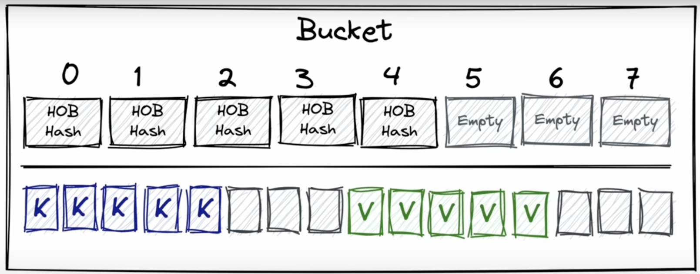
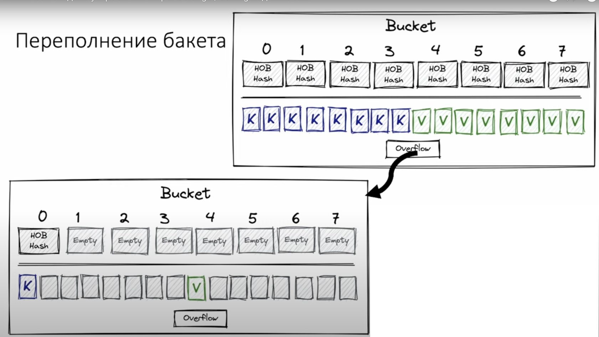
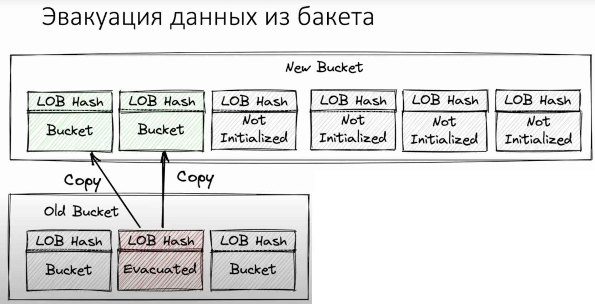

## Требования к реализации

- Вставка
- Удаление
- Поиск

**И все за константное время!**

## Реализация

###  Версия 1

```Go
type entry struct {
    key string
    value int
}
type simpleMap [entry

func lookup(m simpleMap, key string) int {
    for - e := range m {
        if e.key == key {
            return e.value
        }
    }
    
    return 0
}
```

Но! Это O(n) поиск. Неудовлетворительно.

###  Версия 2

Можем разбить на группы и искать в конкретных группах. 


Это потребует как-то организовать равномерное распределение ключей по группам. Для этого - нам подходит хеш-функция.

К хещ-функции есть следующие требования:

- Равномерность
- Быстрота
- Детерминированность
- Криптоустойчивость

Как это реализовать?

Понятно, что v = m[k] - скопилируется в v = runtuime.lookup(m, k). 

Тогда сигнатура такой функции будет такой:
func<k,v> lookup(m map[k]v, k k) v
 
Но дженерики появились недавно, как разрабы обошлись без них?

- Все операции выполняются с помощью unsafe.Pointers
- Мета-инфа хранится в type descriptor
- type descriptor предоставляет операции hash, eqal, copy

То есть, есть структурка, которая хранит в себе всю необходимую инфу: размер типа и функции, о которых говорили выше:
```Go
type _type struct {
    size uintptr
    equal func (unsafe.Pointer, unsafe.Pointer) bool
	...
}
```
В каждой мапе четко определен дескриптор типа и для ключа и для значения:
```Go
type mapType struct {
    key * _type
    value * _type
	hash func (unsafe.Pointer, uintptr) uintptr
	....
}
```

В итоге V = m[k] скомпилируется в:

```Go
pk:= Unsafe.Pointer(&k)
func lookup(t *mapType, m *mapHeader, k unsafe.Pointer) unsafe. Pointer
pv := runtime.lookup(typeOf(m), m, pk)
V = *(*V)pv
```

Тут есть новый параметр - mapHeader. Это структура, которая хранит в себе все основную инфу о мапе:
- Размер (кол-во элементов в мапе)
- Логарифм от кол-ва бакетов (меньше храним и ускоряет побитове операции)
- Ссылку на бакеты (массив указателей на бакеты)
- Хеш сид (безопасность)

Сами бакеты представляют из себя структуру, которая хранит в себе:
- Low Order Bits (LOB) - младшие биты хеша
- И сами бакеты

Небольшое отсупление про LOB:
Здесь используется интересное свойство битовой арифметики, а именно - то, что остаток от деления x на y - этo n младших битов числа x, где n - это логарифм y по основанию 2 от y. Тут нам и пригодится хранение логарифма от кол-ва бакетов в виде логарифма от кол-ва бакетов.


Сами же бакеты выглядят так:


Мы видим 8 слотов для значений, и в каждом бакете есть массив с High Order Bits (HOB) - старшие биты хеша, чтобы проверять по ним есть в этом бакете ключ и пары ключей и значений, которые лежат не по парам, а последовательно для выраванивания типов.

## Рост мапы

Когда мапа заполняется, она растет. Как это происходит? 

В кажом бакете хранится еще указатель на другой баке, который инициализируется, когда текущий бакет заполняется.


Понятное дело, что ждать каждый раз пока мапа полностью заполнится - не самая лучшая идея. Поэтому есть такая штука, как load factor - это примерное кол-во элементов, при котором мапа увеличивается. На текущий момент это 6.5.

Вот комментарий от разработчика этой логики:

Picking loadFactor: too large and we have lots of overflow
buckets, too small and we waste a lot of space. I wrote
a simple program to check some stats for different loads:
(64-bit, 8 byte keys and elems)
loadFactor    %overflow  bytes/entry     hitprobe    missprobe
4.00         2.13        20.77         3.00         4.00
4.50         4.05        17.30         3.25         4.50
5.00         6.85        14.77         3.50         5.00
5.50        10.55        12.94         3.75         5.50
6.00        15.27        11.67         4.00         6.00
6.50        20.90        10.79         4.25         6.50
7.00        27.14        10.15         4.50         7.00
7.50        34.03         9.73         4.75         7.50
8.00        41.10         9.40         5.00         8.00

%overflow   = percentage of buckets which have an overflow bucket
bytes/entry = overhead bytes used per key/elem pair
hitprobe    = # of entries to check when looking up a present key
missprobe   = # of entries to check when looking up an absent key

Этот процесс называется **эвакуацией данных** из бакета. Состоит он в том, что создается новый список данных, который в 2 раза больше, чем предыдущий и данные из старых бакетов переносятся в новые. При этом, если в старом бакете был указатель на другой бакет, то он переносится в новый бакет.

Но этот процесс не быстрый и хоть память и выделяется, но сразу не инициализируется, так как это было бы очень дорого. Поэтому, он совершается инкерментально - при вставке и удалении из мапы.


Все равно, это дает значительный оверхед, так как приходится смотреть в двух местах. Поэтому - лучше ЗАРАНЕЕ выделять нужное кол-во элементов.

## Вопросы для самопроверки

- Почему мы не можем взять указатель на элемент в мапе?
- Все из-за эвакуации бакетов. Если мы возьмем указатель на элемент, а потом добавим новый элемент и мапа расширится, то указатель станет невалидным. 

- Почему в мапе обход идет в случайном порядке?
- Очень много нужно учитывать параметров: какая хеш-функция, какой размер бакета, какой размер мапы, была эвакуация. Поэтому обход идет в случайном порядке.

- 
