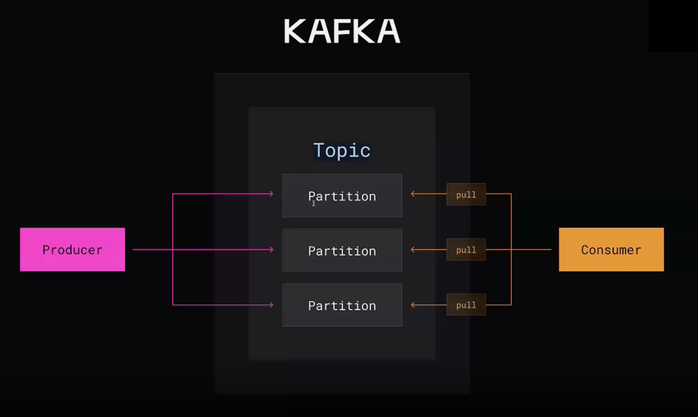
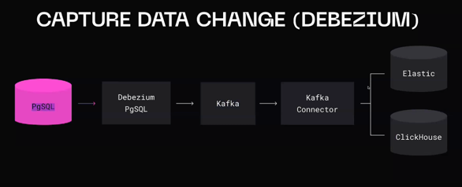

# Брокеры сообщений

## Плюсы:
 - Асинхронная связь
 - Слабое связывание
 - Масштабируемость
 - Отказоустойчивость
 - Понимание потоков данных
 - Возможность планировать исполнение

## Kafka

### Основные термины
- Producer - писатель
- Consumer - читатель
- Broker - один узел кафка
- Topic - логическая очередь
- Partition - физическая часть очереди

### Верхнеуровневое устройство

## Data retention

Относится к стратегии и политикам, определяющим как долго данные будут храниться в базе данных.

Это включает в себя определение периода хранения данных, после которого они могут быть удалены, модифицированы или архивированы

## Гарантии доставки

- At least once - сообщение будет доставлено хотя бы один раз
- At most once - сообщение будет доставлено максимально один раз
- Exactly once - сообщение будет доставлено точно один раз

Достигается с помощью ключей идемпотентности

## Как перенести данные из одного хранилища в другое?

