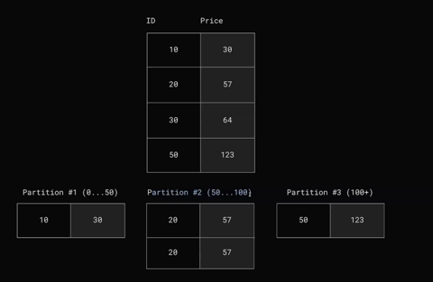
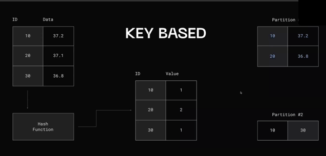
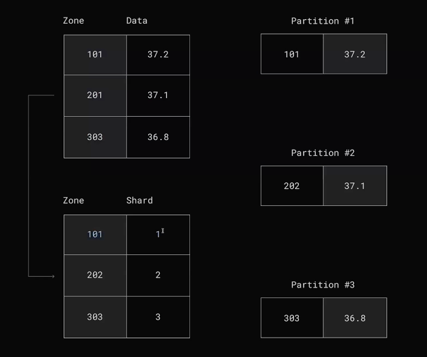

# Партиционирование

Метод разделения больших таблиц на много маленьких и желательно чтобы это происходило прозрачным для приложения образом.

**Секции находятся на одном и том же инстансе базы данных!**

## Сценарии использования

1. Ограничения на размер таблицы, индекса, количества строк (когда-то в PgSQL был 32ТБ максималльный размер был для таблицы)
2. Распределение нагрузки (партиции на разных дисках)
3. Охлаждение данных (одни партиции на SSD, а другие - на HDD)
4. Удаление данных (партиционирование по дням. Например - трейсы записывать по дням и дропать после TTL)

## Вертикальное

Разбиваем табличку на куски. Можно вынести определенные колонки на ssd, к которым чаще обращаются, например.

## Горизонтальное

Когда берем и нарезаем данные на кусочки по строкам. Тут уже сложнее...

Как тогда распределять данные по партициям?

### Range based

### Key based

### Directory based

Есть табличка, которая распределяет по определенному критерию по "таблице маршрутизации"

