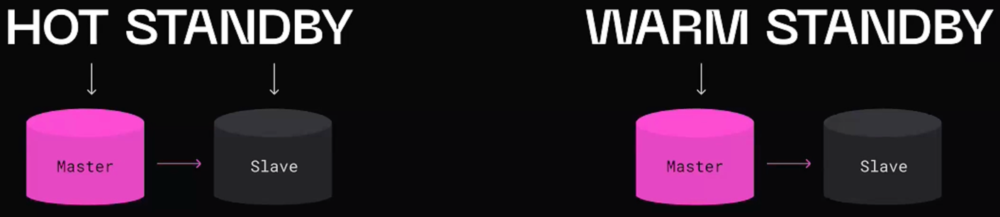

# Репликация

**Классная статья:** https://struchkov.dev/blog/ru/database-replication/

**Бекап** - резервное копирование содержимого диска с целью последующего восстановления. Ооочень долго, так как процесс поднятия занимает кучу времени.

**Репликация** - это процесс создания и поддержания копий базы данных на нескольких серверах.


Зачем тогда нужны бекапы?

Данные можно не только потерять, но и испортить удалив или изменив, а, в случае с репликацией, у нас нет истории.

## Сценарии использования репликации

- Увеличение отказоустойчивости
- Масштабирование чтения
- Размещение данных ближе к пользователю

**РЕПЛИКАЦИЯ НЕ МАСШТАБИРУЕТ ЗАПИСЬ!** Ее все равно нужно синхронизировать на все узлы

_Replication factor_ - кол-во реплик

## Виды репликации

## Куда

#### **Master-slave**

1. Пишем в мастер
2. Читаем из слейвов или из мастера
3. В случае падения мастера получаем downtime на запись

##### Проблемы 
Когда мастер падает - нужно повысить ранг какой-то реплики. Это называется **Failover**. 

Если мастер вышел из строя, мы выбрали новый, а потом ожил стары - происходит **SPLIT Brain**. Решается с помощью поколений.

##### Standby



Hot - все реплики могут принимать запросы.
Hot standby — термин для описания возможности обращаться к серверу и выполнять запросы на чтение, пока сервер находится в режиме восстановления или ожидания. Это полезно как в целях репликации, так и для восстановления резервной копии до желаемого состояния с большой точностью.

Warm - только пока не пойдет что-то не так.
Может быть активирован немедленно, но не может выполнять полезную работу до момента активации. Если мы непрерывно передаем последовательность WAL файлов на другую машину, на которую была загружена базовая резервная копия той же базы, то у нас система warm standby: в любой момент мы можем активировать вторую машину, и на ней будет почти актуальная копия базы данных.

#### **Master-master**

Чаще всего - когда несколько дц

1. Появляются конфликты
2. Пишем в разные мастера
3. Читаем из слейвов и мастеров
4. В случае падение мастера нет downtime на запись

##### Проблемы

Master 1: set user_1 500
Master_2: set user_2 400

Можно решать следующими способами:

- Last Write Wins
- Ранг реплик
- Разрешение конфликтов на клиенте

### Когда

####  Синхронная

Про согласованность

**Local + remote commit (данные доступны везде)**

1. Локальная запись данных
2. Отправка данных на реплику
3. Получение подтверждения от реплики об удаленной записи данных
4. Возвращение подтверждения клиенту

#### Асинхронная

Про скорость

Local commit (данные доступны только локально)

1. Локальная запись данных
2. Возвращение подтверждения клиенту
3. Отправка данных на реплику

Через какое-то время все реплики будут актуальными. Это время называется replication lag.

##### Чтение собственных записей
Для того, чтобы бороться с ситуациями, когда пользователь читает запись, которые недавно записал и они "моргают", так как запросы на чтение приходят то на мастер, то на реплику - Можно отследить, когда пользователь в последний раз отправлял обновление. Если он отправил обновление, например в течение последней минуты, то запросы на чтение должен обрабатываться главным узлом , 

##### Запись в две реплики
Осуществляется запись в два мастера с асинхронной репликой, а при чтении - осуществляется мердж данных

##### Монотонное чтение

Чтобы читать записи других пользователей - Можно обеспечить, чтобы каждый пользователь всегда читал из одной и той же реглики (разные пользователи могут читать с разных реплик)

#### Полусинхронная

Local commit + remote ack (данные доступны только локально, но уже скопированы везде)

1. Локальная запись данных
2. Отправка данных на реплику
3. Получение подтверждения от реплики о **получении** (не фиксации, как в синхронной) изменений
4. Возвращение подтверждения клиенту

### Кто ответсвенный за рассылку изменений

#### push
мастер рассылает данные репликам (PgSQL)

#### pull 
реплики стягивают данные сами (MySQL)

### Как передавать данные репликам

#### Логическая репликация

##### SBR
STATEMENT BASED REPLICATION

Передаю сами запросы: 
```sql
UPDATE users SET name = "Ivan" WHERE id = 500
```

Проблемы с UNIX_TIMESTAMP() , UUID () , RAND () ,

##### RBR
ROW BASED REPLICATION
Передаю измененные данные: 
```json
{"id" :500, "name": "Ivan"}
```
Проблемы с UPDATE users SET active = true

##### Mixed

БД использует разные подходы в зависимости от запроса


