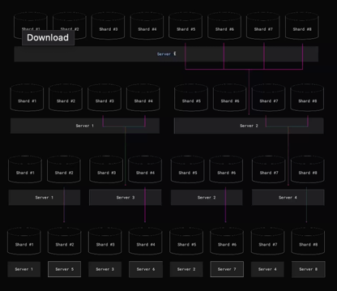
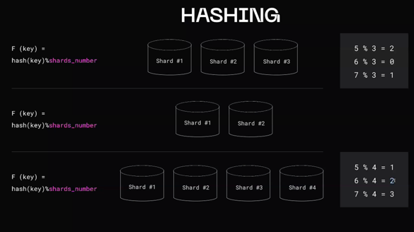
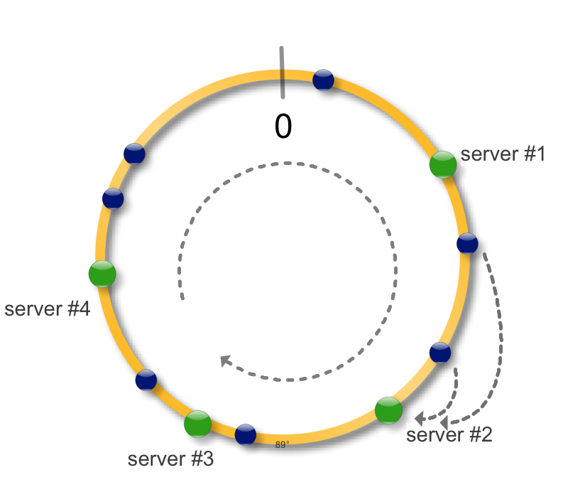
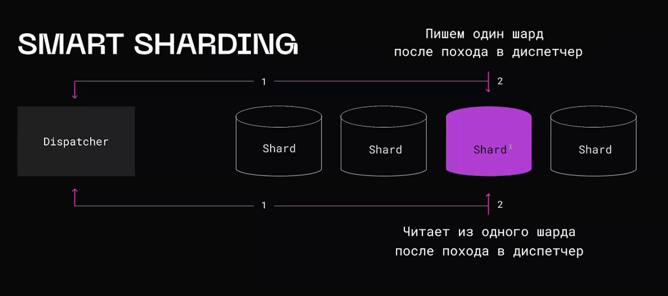

# Шардирование

Подход, предполагающий разделение таблиц на независимые сегменты, каждый из которых управляется отдельным инстансом базы данных.

Шардирование отличается от партиционирование тем, что хосты, на которых располагаются данные - независимы и, благодаря этому, масштабируется запись.
## Сценарии использования

1. Уперлись в ресурсы одного сервера
2. Данные не помещаются на одном сервере

## Базовые подходы

1. Обычно, данные, которые в дальнейшем потребуются вместе - должны храниться вместе.

2. Но иногда - специально хранят данные по разным местам, чтобы параллельно их обрабатывать - MPP (Massively Parallel Processing) подход

## Routing | Как понять в какой шард идти за данными

### На уровне БД

Это круто, но не все умеют

### Клиентский роутинг

#### Плюсы:
- Нет лишних узлов

#### Минусы:
- Дополнительная логика в клиенте
- Сложности с обновлением хостов

### Proxy

#### Плюсы:
- приложение не знает о шардинге

#### Минусы:
- Доп. сетевой узел
- Потеря функциональности (кросс-шардинговые запросы)
- Единая точка отказа

### Coordinator (прокси с логикой)

#### Плюсы:
- кэширование
- приложение не знает о шардинге

#### Минусы:
- Доп. сетевой узел
- Инфраструктурная сложность
- Единая точка отказа

## Переливка данных | Перебалансировка

Как перенести данные из одного шарда на другой?

### Виртуальные шарды (vbuckets)

Отделяем шарды от серверов. Что-то типо виртуальной памяти. Чтобы клиент ничего не знал о низлежащих серверах.

Процесс перебалансировки представляет из себя как раз таки переливку данных с виртуального шарда на одном сервере на другой.

### Подходы к перебалансировке:

1. Врубаем только чтение и перетаскиваем все
2. Пишем только  в target, а читаем из обоих
3. Логическая репликация с source на target, после синхронизации - переключаемся на target

## Решардинг

- Когда нам нужно добавить/удалить ноды
- исправление ошибок при выборе стратегии шардирования

Все плывет при добавлении/удалении:

### Consistent hashing

http://dyagilev.org/blog/2012/03/23/consistent-hashing/

Идея простая, возьмем окружность и будем рассматривать ее как интервал на котором определена хеш-функция функция. Применив хеш-функцию к набору ключей (синие точки) и серверов (зеленые точки) сможем разместить их на окружности.

## Smart Sharding

Представим, что мы пишем мессенджер и выбираем стратегию шардирования для сообщений. Самое логичное - сделать по чатам, но проблема в том, что мы не можем предугадать активность чатов и даже, если мы  будем брать хеш по кол-ву пользователей и ил чата - то все равно могут возникать hot point-ы.

Для решения этой проблемы используется smart sharding:

Логикой 
