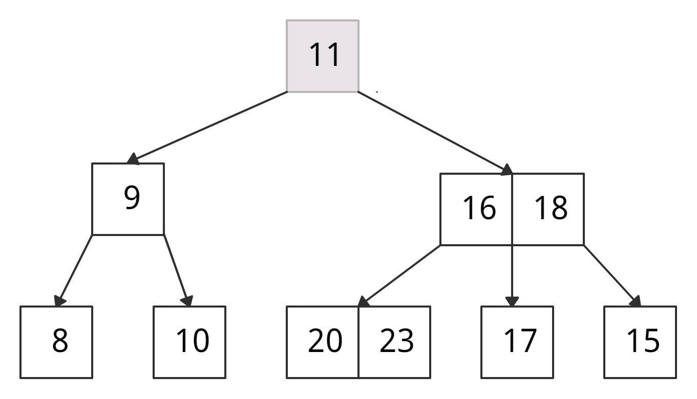
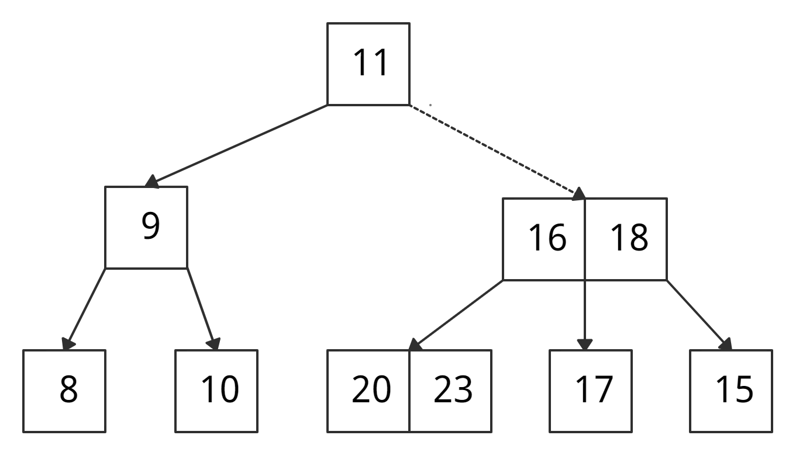
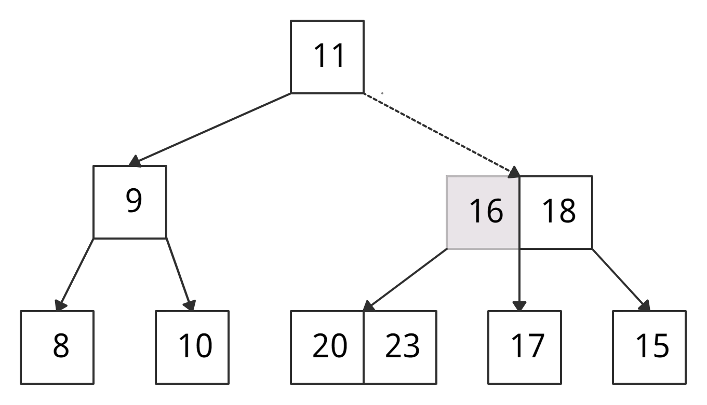
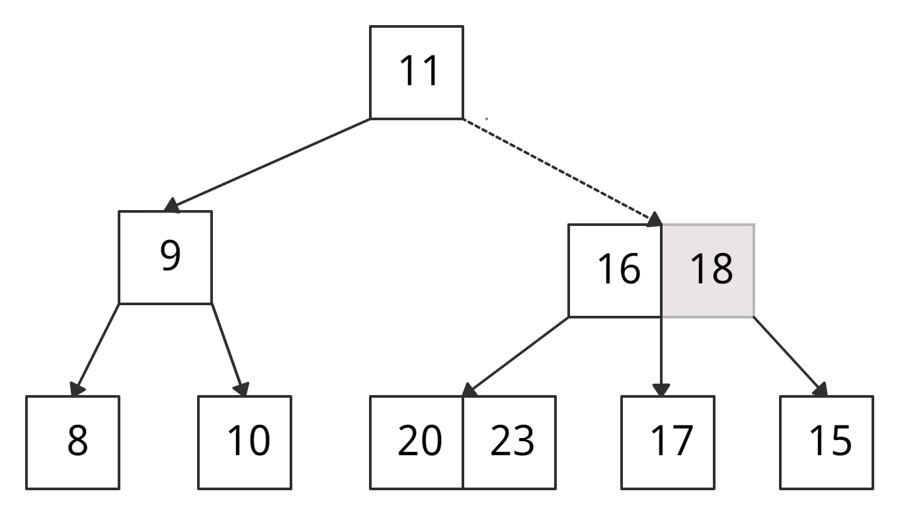
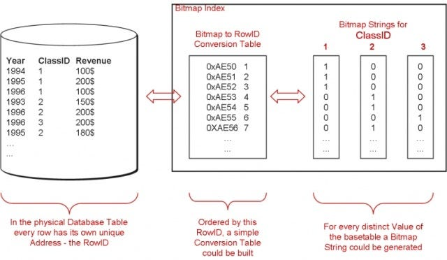
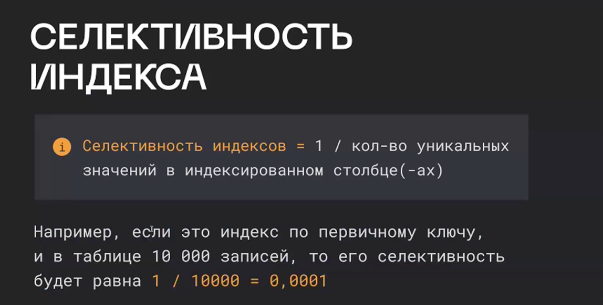

## Индексы

Индексирование баз данных — это техника, повышающая скорость и эффективность запросов к базе данных. Она создаёт отдельную структуру данных, сопоставляющую значения в одном или нескольких столбцах таблицы с соответствующими местоположениями на физическом накопителе, что позволяет базе данных быстро находить строки по конкретному запросу без необходимости сканирования всей таблицы.

Селективность индекса -  характеристика, определяющая, насколько эффективно индекс разбивает данные.

Примеры индексов и их селективности:
- Номер паспорта: высокая селективность
- Возраст человека: средняя селективность
- Пол человека: низкая селективность

В случае достаточно низкой селективности индексы не используются, так как в такой ситуации полное последовательное чтение таблицы эффективнее, чем несколько случайных чтений.

## B-tree

- Это именно дерево поиска, то есть - полезная нагрузка хранится в листьях
- Оно сбалансированно, то есть - высота левого и правого поддеревьев каждого узла отличается не более чем на единицу.

B-дерево (читается как Би-дерево) — это особый тип сбалансированного дерева поиска, в котором каждый узел может содержать более одного ключа и иметь более двух дочерних элементов. Из-за этого свойства B-дерево называют сильноветвящимся. 

Свойства
- Ключи в каждом узле x упорядочены по неубыванию.
- В каждом узле есть логическое значение x.leaf. Оно истинно, если x — лист.
- Каждый узел, кроме корня, содержит не менее t-1 ключей, а каждый внутренний узел имеет как минимум t дочерних узлов, где t — минимальная степень B-дерева.
- Все листья находятся на одном уровне, т. е. обладают одинаковой глубиной, равной высоте дерева.
- Корень имеет не менее 2 дочерних элементов и содержит не менее 1 ключа.

Поиск элемента Θ(log n)

- Сравниваем k с первым ключом узла, начиная с корня. Если k = первый ключ узла, возвращаем узел и индекс.
- Если k.leaf = true, возвращаем NULL. Элемент не найден.
- Если k < первый ключ корня, рекурсивно ищем левый дочерний элемент этого ключа.
- Если в текущем узле более одного ключа и k > первый ключ, сравниваем k со следующим ключом в узле.
- Если k < следующий ключ, ищем левый дочерний элемент этого ключа (k находится между первым и вторым ключами).
- Иначе иначе ищем правый дочерний элемент ключа.
- Повторяем шаги с 1 по 4, пока не дойдем до листа.

Пример: хоти найти ключ k = 17



• k нет в корне → сравниваем k с ключом корня.



• k > 11 → идем через правого «ребенка».



• Сравниваем k с первым ключом узла: k > 16 → сравниваем k со вторым ключом узла. 



• k > 18 → k лежит между 16 и 18. Ищем либо в правом «ребенке» 16, либо в левом «ребенке» 18.


• Нашли 17.

## Хеш-индекс

Хэш-индекс — это разновидность методики индексирования баз данных, использующая хэш-функцию для сопоставления ключей индекса с местоположениями соответствующих записей данных. Это быстрый метод индексирования для запросов точного соответствия в одном столбце.

## Bitmap-индексирование

Это методика индексирования данных, использующая битовые карты (bitmap) для обозначения наличия или отсутствия значения в таблице. Это успешная техника индексирования для таблиц с низкой кардинальностью, где количество уникальных значений в столбце довольно мало по сравнению с общим количеством строк.

Bitmap-индексирование может быть очень эффективным для столбцов с низкой кардинальностью, поскольку битовые карты крайне компактны и их можно быстро сканировать для извлечения данных. Bitmap-индексы очень удобны для применения в хранилищах данных, где необходимо быстро сканировать огромные объёмы данных. Кроме того, они полезны для баз данных, в которых много операций чтения, но мало обновлений или вставок.

Как это работает

Для создания bitmap-индекса столбца для каждого уникального значения столбца создаётся отдельный bitmap. Каждый bitmap имеет длину, равную количеству строк в таблице.
Если значение присутствует в строке, соответствующему биту в bitmap присваивается значение 1, а если оно отсутствует, то присваивается значение 0. (Представьте таблицу, где столбец «Gender» имеет два уникальных значения, например, «Male» и «Female». Если этот столбец имеет bitmap-индекс, можно создать два bitmap, длина каждого из которых равна количеству строк в таблице. Когда в строке встречается «Male» или «Female», соответствующий бит в bitmap «Male» или «Female» получает значение 1, и наоборот. В случае отсутствия значения «Male» или «Female» соответствующему биту присваивается значение 0.)
Чтобы выполнить запрос при помощи bitmap-индекса, соответствующие в запросе значения bitmap комбинируются при помощи побитовых операторов AND, OR и NOT. (например, если мы хотим найти все строки, где «Gender» равно «Male» И «Age» больше 30, нам сначала нужно получить bitmap «Male» и bitmap «Age > 30» из соответствующих индексов. Затем мы комбинируем эти два bitmap при помощи побитового оператора AND и получаем окончательный bitmap только с единицами в тех позициях, где оба условия истинны. Затем окончательный bitmap используется для получения из таблицы строк, удовлетворяющих запросу.)




## **Кластерный vs Некластерный индекс**

Что такое кластерный индекс?
Кластерный индекс — это тип индекса, который сортирует строки данных в таблице по их ключевым значениям. В базе данных есть только один кластеризованный индекс для каждой таблицы. Кластерный индекс определяет порядок хранения данных в таблице, которая может быть отсортирована только одним способом. Таким образом, для каждой таблицы может быть только один кластеризованный индекс. Обычно в СУБД первичный ключ позволяет создать кластеризованный индекс на основе этого конкретного столбца.

Что такое некластеризованный индекс?
Некластеризованный индекс хранит данные в одном месте, а индексы — в другом. Индекс содержит указатели на расположение этих данных. Одна таблица может иметь много некластеризованных индексов, поскольку индекс в некластеризованном индексе хранится в разных местах.
Например, книга может иметь более одного указателя, один в начале которого отображает содержание книги по единицам, а второй указатель показывает указатель терминов в алфавитном порядке.

## **Покрывающий индекс**
Покрывающий индекс — самый быстрый способ выбрать данные из таблицы.

Разберемся на примере запроса, который выбирает сотрудников с указанной зарплатой:

```SQL
select id, name from employees
where salary = 90;
```
Без индекса и с ним
Если нет индекса, движок базы обходит всю таблицу (так называемый «фулскан»):

QUERY PLAN
`--SCAN employees
Создадим индекс по зарплате:

create index employees_idx
on employees (salary);
Теперь движок найдет записи по зарплате в индексе (это быстрее, чем обходить всю таблицу). И для каждой найденной записи обратится к таблице, чтобы получить значения id и name:

QUERY PLAN
`--SEARCH employees USING INDEX employees_idx (salary=?)
Покрывающий индекс
Создадим покрывающий индекс (охватывает все выбираемые столбцы):

create index employees_idx
on employees (salary, id, name);
Теперь движок базы отрабатает только по индексу, вообще без обращения к таблице. Это еще быстрее:

QUERY PLAN
`--SEARCH employees USING COVERING INDEX employees_idx (salary=?)
Не всегда достаточно просто добавить в индекс все столбцы из запроса. Нужно еще, чтобы их порядок допускал быструю выборку по индексу.

Допустим, мы построили индекс с теми же столбцами, но в другом порядке:

create index employees_idx
on employees (id, name, salary);
Теперь движок не сможет быстро выбрать записи по условию salary = 90. Он все еще может использовать индекс, но будет вынужден полностью обойти его (фулскан по индексу) вместо того, чтобы моментально найти нужные записи.

QUERY PLAN
`--SCAN employees USING COVERING INDEX employees_idx
(обратите внимание на SCAN вместо SEARCH)]


Покрывающие индексы дорого обходятся при изменении данных в таблице, поэтому на каждый вид запросов их создавать не стоит. Чаще это одно из последних средств оптимизации, когда все остальное уже сделали.

_**Когда запрос может пройти мимо индекса?**_

- Мало записей
- Селективность индекса - если у индекса низкая селективность, то база может идти по фуллскан вместо него



## Партиционирование

Наравне с индексами существует еще один способ ускорить поиск данных. Это **партиционирование**.

Партиции - это техника физического разделения таблицы на несколько меньших логических таблиц, называемых партициями. Каждая партиция обычно содержит подмножество строк таблицы, и эти подмножества могут быть определены по различным критериям, таким как диапазон значений ключей, дата или регион расположения.

Партиционирование может привести к улучшению производительности базы данных и более эффективному использованию хранилища данных, особенно при работе с большими объемами данных. Некоторые преимущества партиционирования:

- Ускорение запросов: разбиение таблицы на партиции может ускорить запросы, поскольку каждая партиция может быть обработана параллельно на разных процессорах.
- Упрощение обслуживания: партиционирование может упростить задачи обслуживания базы данных, такие как резервное копирование и восстановление данных, а также индексирование и оптимизация запросов.
- Более эффективное использование ресурсов: партиционирование может помочь более эффективно использовать ресурсы базы данных, такие как память и пропускная способность дисков.