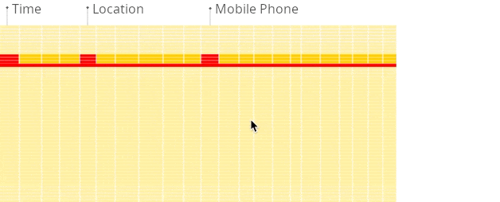
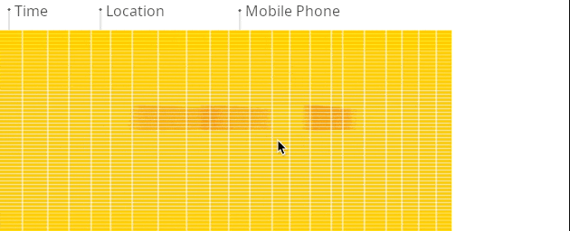

# Хранение баз данных

## OLAP vs OLTP

**OLTP** - это способ организации базы данных, где система обрабатывает множество маленьких транзакций с большой скоростью.

Транзакция это упорядоченная последовательность операций где или все операции будут выполнены до конца, или все изменения откатятся назад, например при добавлении строчки данных в БД, будет добавлена полностью или же не добавлена вовсе.

Классическая задача для OLTP системы это частое чтение мелких данных, например информации по пользователю. То есть мы часто читаем с диска небольшими порциями, все колонки.

**OLAP** - это технология, используемая для анализа больших объемов данных в режиме реального времени. OLAP системы предназначены для анализа данных, предоставляя пользователю возможность исследовать данные из разных углов зрения, проводить анализ и строить графики и отчеты.

Для нее характерно следующее поведение - мы редко читаем/пишем данные с диска, однако большими порциями, и используем большое количество сложных агрегаций для аналитики, выбираем только необходимые колонки.

Основными преимуществами OLAP систем являются:

Высокая производительность при работе с большими объемами данных
Возможность анализировать данные в режиме реального времени

