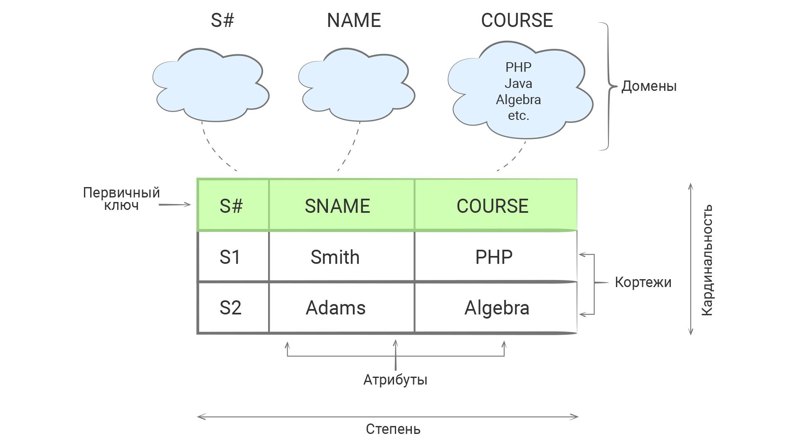
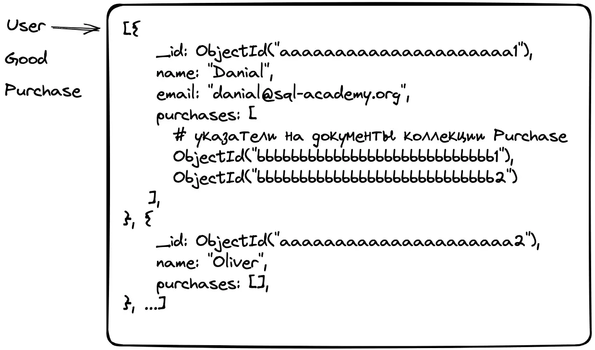
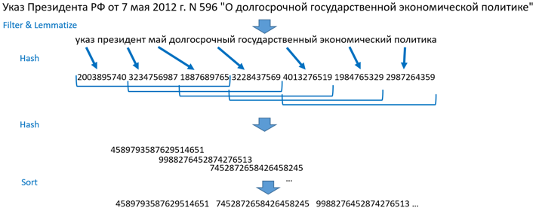
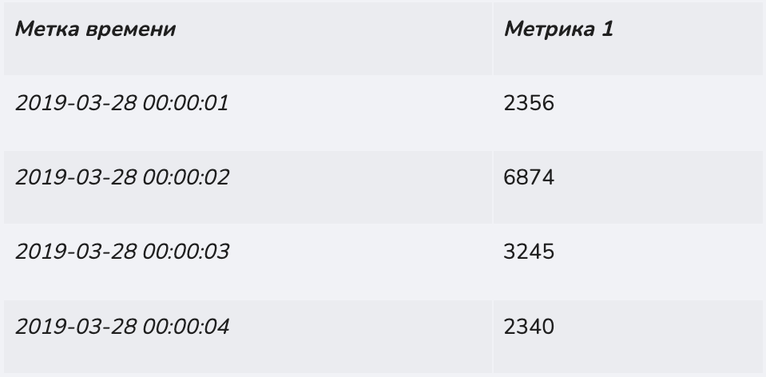

## Виды баз данных

### Реляционные

Реляционной базой данных называется совокупность отношений, содержащих всю информацию, которая должна хранится в базе. В данном определении нам интересен термин отношение, но пока оставим его без строго определения.
Лучше представим себе таблицу продуктов.

В отношении требованием является то, что все кортежи должны различаться. Для однозначной идентификации кортежа существует первичный ключ. Первичный ключ это атрибут или набор из минимального числа атрибутов, который однозначно идентифицирует конкретный кортеж и не содержит дополнительных атрибутов.
Подразумевается, что все атрибуты в первичном ключе должны быть необходимыми и достаточными для идентификации конкретного кортежа, и исключение любого из атрибутов в ключе сделает его недостаточным для идентификации.
Например, в такой таблице ключом будет сочетание атрибутов из первого и второго столбца.

### Колоночные

**Колонки vs Строки**

Строчное хранение данных

Это способ организации данных на жестком диске в виде строк, разумеется данные не лежат как строки в таблице, однако принцип упорядочивания данных по секторам позволяет считать одну строку со всеми колонками быстрее нежели один столбец. Тут можно придраться касаемо объемов считываемых данных, но данное упрощение на мой взгляд поможет понять разницу между двумя подходами.

Колоночное хранение данных

Это способ хранения информации на жестком диске, при котором данные каждого столбца таблицы записываются в отдельно. При колоночном хранении каждый столбец таблицы представлен отдельным файлом (мы это увидим когда будем разбираться с устройством ClickHouse), что позволяет извлекать только необходимые данные, не считывая лишнюю информацию из других столбцов, это повышает производительность аналитических запросов, в которых обычно выбираются конкретные столбцы. Также колоночное хранение позволяет эффективно сжимать данные, что может значительно сократить занимаемое пространство на жестком диске.

### Документ ориентированные БД

Mongo, Cocroach db

Документоориентированные базы данных – это тип баз данных, направленный на хранение и запрос данных в виде документов, подобном JSON.

В отличие от других баз данных, документоориентированные оперируют «документами», сгруппированными по коллекциям. Документ представляет собой набор атрибутов (ключ и соответствующее ему значение). Значения могут быть как и простыми типами данных (строки, числа или даты), так и более сложными, такими как вложенные объекты, массивы и ссылки на другие документы.

#### Поисковые движки

ElasticSearch

Eсли вам необходимо осуществлять поиск большим объемам данных, особенно неструктурированным, как пример поиск по нескольким терабайтами логов, то вам может пригодиться использовать базу данных, совмещающую с функционалом хранения информации еще и функционал поиска по текстам.

Представим, что у вас есть N петабайт логов (или других текстовых данных). Обычный поиск по словам уже не подойдет, чтобы осуществить поиск и аналитику в разумное время.

На помощь приходит индексирование. Если очень утрировано его рассмотреть, можно его представить следующим способом. Каждому слову/лемме/n-грамме присвоим индекс и запишем эти индексы в специальную таблицу, где строки, это документ, а в столбики это индексы. Похожая система используется для построения систем поиска плагиата, правда там чаще применяют не слова, а шинглы (индексы с наслоением).

А искать по индексу существенно быстрее, чем по совпадению по словам в документах.

Строго говоря, для поиска по документам можно использовать и эмбеддинги нейронных сетей, в которых закодирован "смысл" высказываний. Но для данной задачи лучше подойдут векторные базы данных, которые замыкают наш список.

Разумеется, современные поисковые СУБД предлагают значительно более широкий функционал.

Наиболее популярны такие решения как Elasticsearch (и его версия - OpenSearch), проприетарный Splunk, о котором я писал одну из прошлых статей и Sphinx.

### Key-value

Redis, memcached, tarantool

Тип баз данных Key-value предназначен для осуществления быстрых, почти мгновенных запросов для таких задач как кэш, отображение баланса и т.д.. Высокая скорость осуществляется за счет хранения данных по принципу ключ-значение, и в большинстве случаев благодаря работе в оперативной памяти.

Словари содержат коллекцию объектов или записей, а объекты содержат множество различных полей, каждое из которых содержит данные. Записи хранятся и извлекаются с использованием ключа, который однозначно идентифицирует запись и используется для быстрого поиска данных.

Основным применением является ускорение отображения данных для конечных пользователей и снижение нагрузок, в том числе I/O на инфраструктуру организаций.

#### Wide-Column

Wide-column-базы данных

В основе такой базы лежит простой принцип работы: давайте снова структурировать данные (то есть их значения) в пары «ключ-значение». Вот что у нас есть в базах «ключ-значение»:

А вот как представляют данные Wide-Column-базы:

Столбцы позволяют определять подмножество данных, которое нужно вывести клиенту или обновить. В чем здесь отличие от обычной таблицы реляционной базы данных? В большинстве Wide-column-баз столбцы определяются на уровне одного элемента. Здесь нет схемы на уровне всей БД, что наводит на мысль о некоторых интересных характеристиках Wide-column-баз.

####  Конфигурационные

Etcd, Zookepeer

В мире распределённых систем существует ряд типовых задач: хранение информации о составе кластера, управление конфигурацией узлов, детекция сбойных узлов, выбор лидера и другие. Для решения этих задач созданы специальные распределённые системы — сервисы координации.

### Time-series

InfluxDB

### Blob storage

Ceph, Amazon S3